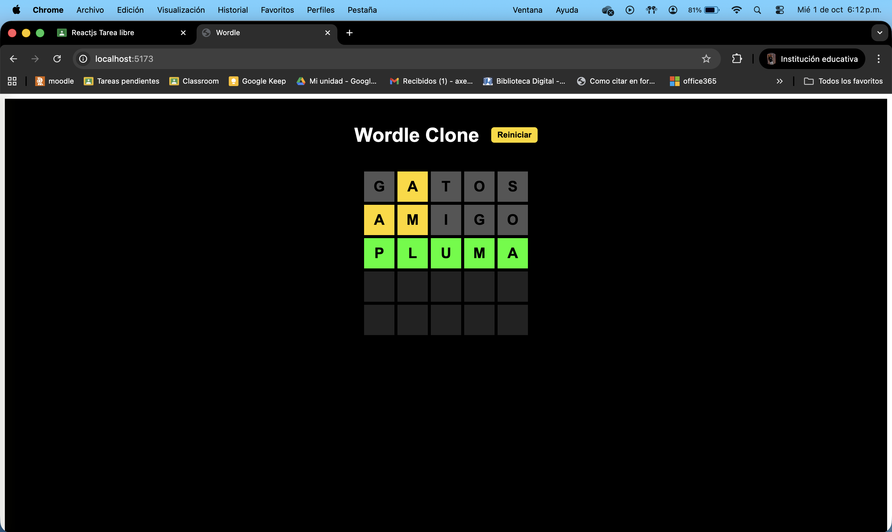

# Wordle Clone - React JS

Este es un clon del popular juego **Wordle** desarrollado en **React JS**.  
El juego permite adivinar una palabra de 5 letras en **5 intentos**.  

---

## 🎮 Funcionalidades

- Adivinar la palabra secreta en 5 intentos.
- Colores visuales:
  - **Amarillo:** letra presente pero en posición incorrecta.
  - **Verde:** letra correcta en posición correcta.
  - **Gris/blanco:** letra no presente.
- Se valida que solo se acepten palabras válidas (de la lista de palabras).
- Muestra los intentos anteriores de manera visual.
- Reinicio del juego con botón.
- Se puede jugar usando el **teclado físico** de la computadora (no requiere teclado en pantalla).

---

## 📝 Archivos principales

- `App.jsx`: lógica principal del juego y manejo del estado.
- `components/Board.jsx`: tablero donde se muestran los intentos.
- `components/Keyboard.jsx`: (opcional) teclado virtual si decides implementarlo.
- `utils/words.js`: lista de palabras válidas y posibles soluciones.
- `utils/gameLogic.js`: funciones de validación y evaluación de letras.

---

## ⚡ Cómo ejecutar el proyecto

1. Clona el repositorio:

```bash
git clone https://github.com/TU_USUARIO/wordle-react.git
```

2. Instala dependencias:

```bash
cd wordle-react
npm install
```

3. Inicia el servidor de desarrollo:

```bash
npm run dev
```

4. Abre el juego en tu navegador:

```bash
http://localhost:5173/
```

## Capturas de pantalla y video

Ejemplo:



Video de demostracion:

[](https://youtu.be/SyM0qF3Wkp0)